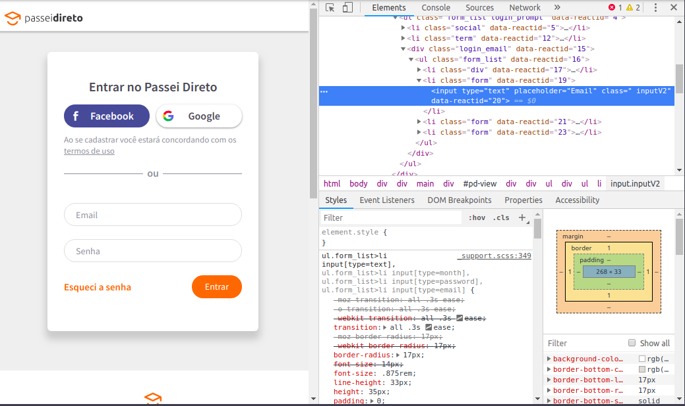
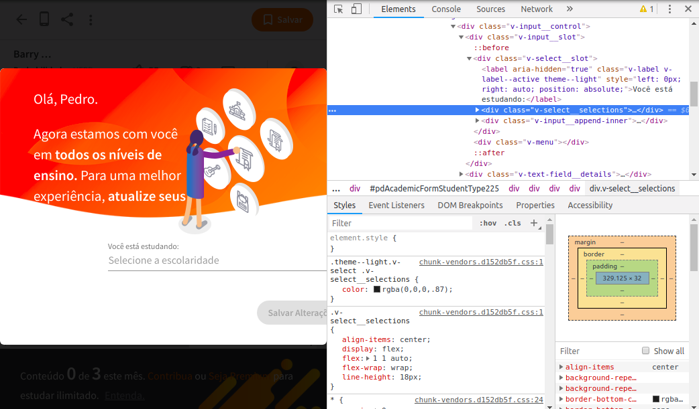
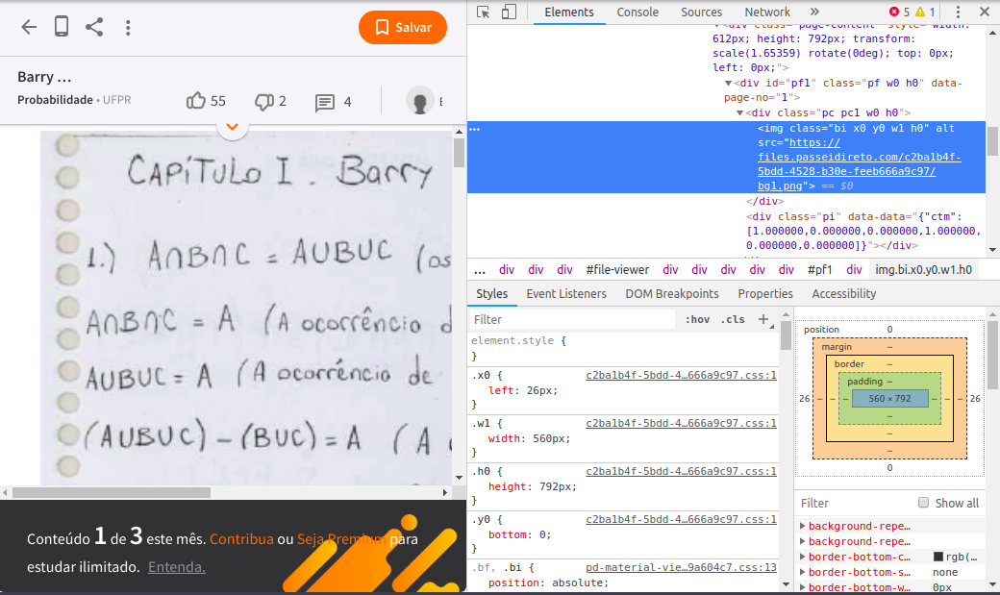
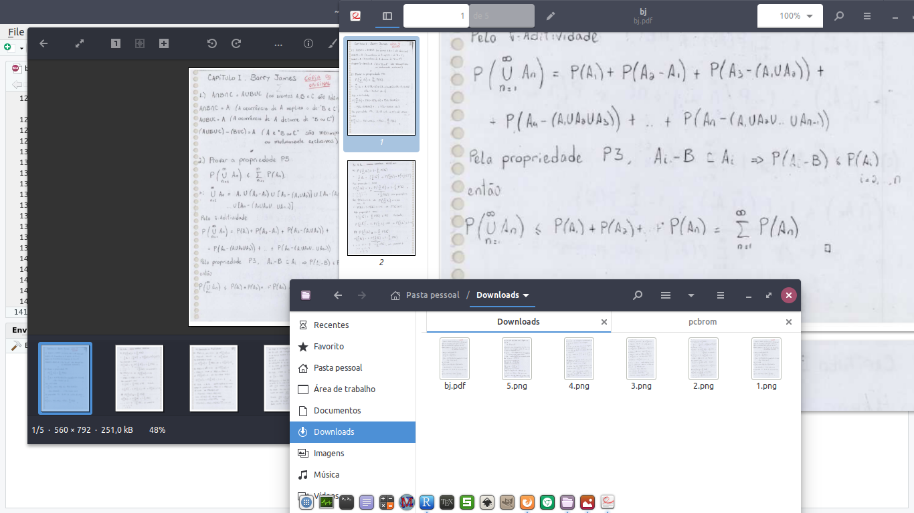

```{r setup, include=FALSE}
knitr::opts_chunk$set(echo = FALSE)
library(knitr)
```

[Passei Direto](https://www.passeidireto.com/){target="blank_"} é um site para troca de arquivos. São áreas variadas e fornece livros, resoluções de livros, apostilas, artigos entre outros. É um repositório fora de série, mas tem o problema de ter que subir algum arquivo em "troca" de outro. 
O ponto desta postagem é como efetuar o download sem ter que fazer essa troca. A qui usaremos ferramentas de automação disponíveis para o R como as bilbiotecas `RSelenium` e o `gmailr`. Além deste usaremos o comando `convert` disponível para sistemas GNU/Linux.

Então segue o tutorial passo a passo.

```{r,eval=FALSE,echo=TRUE}
library(RSelenium) # chamando a biblioteca

# abrindo sistema de navegacao
rD = rsDriver(browser = "chrome", check = F) # abre o navegador sem verificar o driver atual check = F
remDr = rD[["client"]] # inicia a marionete
Sys.sleep(10) # pausa de 10 segundos para carregar tudo 100%

# indo pro site e efetuando o login
remDr$navigate("https://www.passeidireto.com/login") # indo para a página de login
lg = "seu@login" # coloque o seu email cadastrado
pw = "seupass" # coloque a sua senha
```

Nesta tela podemos clicar no campo de `Email` e depois clicar o botão direito pedindo para inspecionar.

```{r,echo=FALSE,fig.align='center'}

```

Aqui temos os caminhos de entrada do campo:

> <input type="text" placeholder="Email" class=" inputV2" data-reactid="20">

Na entrada `imput` temos o campo `placeholder` com o valor `Email`. Veja o script abaixo e compare os caminhos por conta própria das outras entradas.

Aqui fica uma dica. Se estiver usando o `chrome` então use `sendKeysToElement`. Caso esteja cmo o firefox use `sendKeysToActiveElement`.

```{r,eval=FALSE,echo=TRUE}
webElem = remDr$findElement(using = 'xpath', "//input[@placeholder='Email']")
webElem$sendKeysToElement(list(lg))
Sys.sleep(runif(1, 1, 5)) # esperando de 1 a 5 segundos de modo pseudoaleatorio antes de avancar
webElem = remDr$findElement(using = 'xpath', "//input[@placeholder='Senha']")
webElem$sendKeysToElement(list(pw))
Sys.sleep(runif(1, 1, 5))
webElem = remDr$findElement(using = 'xpath', "//button[@class='button orange']")$clickElement()
Sys.sleep(10)
```

Agora vamos para o livro de interesse. 

```{r,echo=TRUE,eval=FALSE}
# indo para o livro
remDr$navigate("https://www.passeidireto.com/arquivo/23932176/barry-james-probabilidade-um-curso-em-nivel-intermediario---resolucoes-exercicio")
```

Neste momento pode aparecer alguma tela que impede a plena navegação do bot. Para tanto vamos resolver o problema. Caso não apareça basta excluir esse próximo passo do script.

```{r,echo=FALSE,fig.align='center'}

```

No mesmo esquema do login clique o botão direito no campo de interesse, digamos `Ensino Fundamental`.

Caixa de seleção:

> <div class="v-select__selections"><input aria-label="Você está estudando:" readonly="readonly" type="text" placeholder="Selecione a escolaridade" autocomplete="on" aria-readonly="false"></div>

Agora a opção `Estudos Gerais`

> <div class="v-list__tile__title">Estudos Gerais</div>

```{r,echo=TRUE,eval=FALSE}
webElem = remDr$findElement(using = 'xpath', "//div[@class='v-select__selections']")$clickElement() # caixa de selecao
webElem = remDr$findElement(using = 'xpath', "//div[@class='v-list__tile__title' and contains(text(), 'Estudos Gerais')]")$clickElement() # opcao que contem o texto Estudos Gerais
```

Faça o mesmo esquema para `Estado`, `Cidade` e depois `Salvar alterações`.

```{r,echo=TRUE,eval=FALSE}
# estado
webElem = remDr$findElement(using = 'xpath', "//div[@class='v-list__tile__title' and contains(text(), 'Distrito Federal')]")$clickElement()

# cidade
webElem = remDr$findElement(using = 'xpath', "//input[@placeholder='Digite sua cidade']")
webElem$sendKeysToElement(list('Brasília'))
webElem$sendKeysToElement(list(key = 'enter'))

# salvar alteracoes
webElem = remDr$findElement(using = 'xpath', "//button[@label='Salvar alterações']")$clickElement()
```

Tudo pronto para iniciar o trabalho. Clique o botão direito para ver a imagem do livro.

```{r,echo=FALSE,fig.align='center'}

```

Repare que temos o padrão para coletar os dados:

> https://files.passeidireto.com/c2ba1b4f-5bdd-4528-b30e-feeb666a9c97/bg1.png

Agora um loop simples resolve tudo que desejamos.

```{r,echo=TRUE,eval=FALSE}
pgs = as.character(1:5) # indexador das paginas. vamos pegar apenas de 1 a 5.

# loop para efetuar o download das paginas
for(i in pgs) {
  endereco = paste0("https://files.passeidireto.com/c2ba1b4f-5bdd-4528-b30e-feeb666a9c97/bg", i, ".png")
  arq = paste0("/home/pcbrom/Downloads/", i, ".png")
  download.file(endereco, arq)
}

# fechar a marionete e parar o webdriver
remDr$close()
rD[["server"]]$stop()
```

Download efetuado. Próximo passo é juntar tudo em um pdf.

```{r,eval=FALSE,echo=TRUE}
comando = "convert /home/pcbrom/Downloads/*.png /home/pcbrom/Downloads/bj.pdf"
system(comando)
```

E o resultado é esse:

```{r,echo=FALSE,fig.align='center'}

```

Tudo isso é muito bom mas tem como melhorar. O arquivo gerado é um pouco grande 1.3MB. Vamos usar o comando `ps2pdf` do Linux e diminuir para apenas 191.1kB.

```{r,echo=TRUE}
comando = "ps2pdf /home/pcbrom/Downloads/bj.pdf /home/pcbrom/Downloads/bjlite.pdf"
system(comando)
file.size("/home/pcbrom/Downloads/bj.pdf")
file.size("/home/pcbrom/Downloads/bjlite.pdf")
```

Falta enviar por email. Essa parte não precisa de detalhamentos do script. Happy coding!

```{r,eval=FALSE,echo=TRUE}
library(gmailr)

file_attachment = mime() %>%
  html_body("") %>% 
  to("seu@email.com.br") %>%
  from("seu@email.com.br") %>%
  subject(paste0("Livro consolidado: ", Sys.Date())) %>%
  attach_file("/home/pcbrom/Downloads/bjlite.pdf")

send_message(file_attachment)
```