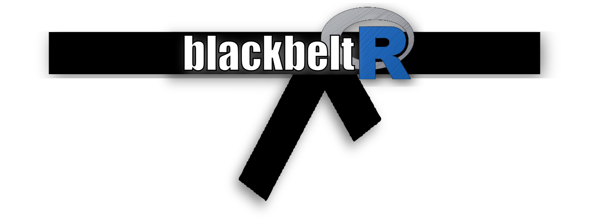

```{r setup, include=FALSE}
knitr::opts_chunk$set(echo = FALSE)
```

<center>

{ width=40% }

</center>

O **blackbeltR Blog** é um espaço colaborativo focado em qualquer aspecto ou tópico 
que envolva programação em R. Os posts e artigos deste blog são oriundos de dúvidas, 
trabalhos e tutoriais indicados por seus usuários.

A principal fonte de alimentação do blog são as discussões apresentadas no grupo 
de WhatsApp do blackbeltR. Você pode ingressar no grupo utilizando este 
[CONVITE](https://chat.whatsapp.com/9SJtJiOw6YN1DtVWeMGUhe). Periodicamente, 
nós selecionamos eventuais técnicas e assuntos discutidos no grupo para compor o 
blog. Os envolvidos são convidados a escreverem um breve post em `RMarkdown`. 
Desta forma, os autores encontram no **blackbeltR Blog** um meio para divulgar seu 
trabalho intelectual, ao mesmo tempo em que contribuem para o crescimento da 
plataforma.

Esperamos que você possa aproveitar o conteúdo disponível, bem como contribuir 
para a manutenção e crescimento do blog!


- Pedro C. Brom
- Allan V. C. Quadros